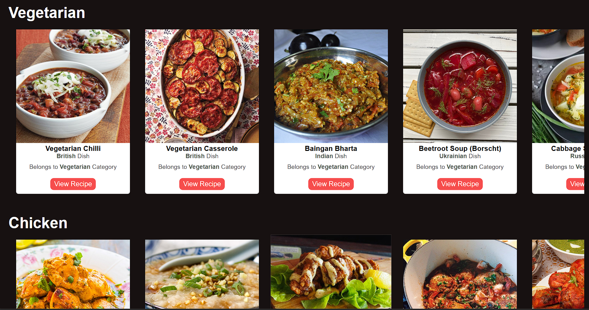

# 🍽️ Recipe App

A clean and responsive **Recipe App** built using HTML, CSS, and JavaScript. It allows users to explore meals by category, view detailed recipes, and discover dishes from around the world. Recipes are dynamically fetched from [TheMealDB API](https://www.themealdb.com/).

## 🌐 Live Demo

👉 [View the Live Site](https://neerajsharma05.github.io/Recipe-App/)

---

## 📌 Features

- ✅ Browse meals by categories (Vegetarian, Seafood, Dessert, etc.)
- ✅ See meal thumbnails and names at a glance
- ✅ Click on a meal to view full recipe details including:
  - Ingredients
  - Instructions
  - YouTube video tutorial (if available)
- ✅ Search bar to find meals by name
- ✅ Responsive design for all screen sizes

---

## 📸 Screenshots

[Home Page](imges/home-page.jpg) <!-- (Optional: Replace with actual screenshot URL) -->

---

## 🛠️ Tech Stack

- **HTML5**
- **CSS3**
- **JavaScript (Vanilla JS)**
- **TheMealDB API**

---

## 📁 Folder Structure
📁 Recipe-App/
├── index.html
├── style.css
├── script.js
└── assets/ (images/icons if any)

---

## 🚀 Getting Started

To run this project locally:

1. Clone the repository:
git clone https://github.com/neerajsharma05/Recipe-App.git

2. Open `index.html` in your browser.

That’s it!

---

## 🙌 Acknowledgements

- [TheMealDB API](https://www.themealdb.com/) for providing free meal data.

---

## 👨‍💻 Author

**Neeraj Sharma**  
📧 [neerajko890.com] 
🌐 [Portfolio Website](https://neerajsharma05.github.io/my-portfolio/) 

---

## ⭐ Show Your Support

If you like this project, please consider giving it a ⭐ on GitHub!

